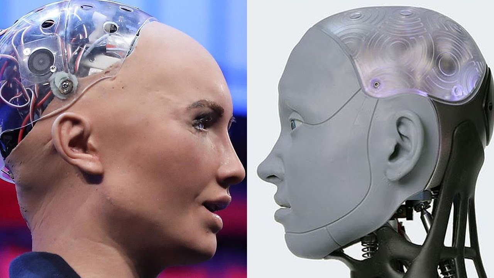
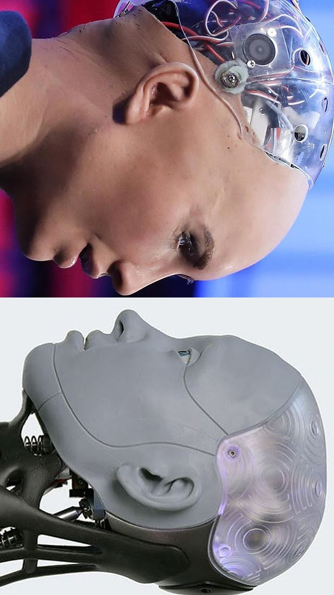

# BMP Image Rotator 📸🔄

This repository contains a C program that demonstrates how to process and manipulate BMP images by rotating them 90 degrees clockwise. It’s an educational project that showcases the basics of image manipulation and file handling in C, and provides insight into how image editing programs work under the hood.

---

## 📝 Problem Description

The program reads a BMP image file as input, processes its pixel data, and writes a new BMP file as output with the image rotated 90 degrees clockwise.

### Input:
- A BMP image file (`input.bmp`).

### Output:
- A new BMP image file (`output.bmp`) rotated 90 degrees clockwise.

### Why BMP?
BMP is a simple and widely-used image format, making it ideal for learning file handling and image processing.

---

## 💡 Solution

### Approach
The program works as follows:
1. **Read the BMP File Header:**
   - Extract metadata like width, height, bit depth, and pixel array offset.
2. **Load Pixel Data:**
   - Read the image pixel data into memory while accounting for BMP’s padding.
3. **Rotate Pixel Data:**
   - Rearrange the pixels to achieve a 90-degree rotation.
4. **Write the Output BMP:**
   - Create a new BMP file with updated metadata and rotated pixel data.

### Key Features
- Demonstrates handling of structured binary files.
- Shows how to manage BMP-specific quirks like row padding.
- Provides insight into memory manipulation in C.

---

## ⚙️ How to Run

### Compilation
Compile the program using:
```bash
gcc -o bmp_rotator solution.c
```
Execution
Run the program with the input BMP file:

```bash
./bmp_rotator < input.bmp > output.bmp
```

### Example
*We can see two of the most advanced humanoid robots: Sophia and Ameca!* \
Input:


Output (rotated 90°): \


## License
This code is open-source under the MIT License.
